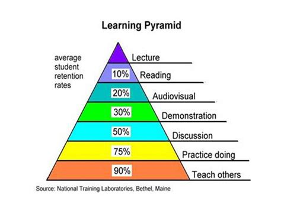

# Module Learning Process

## Learning pyramid

>
>The learning pyramid is a group of popular learning models.
>It represenetations relating different degrees of rention induced from varois type of learning.
>

### Passive Learning

It's a beginning, but as you can see on the pyramid, it's only a small part of learning process.

### Active Learning

Without pratice and a real-life situation, all the theory in the world will not be enough to know how we can react.
That the base :smile: .
:warning: Getting overwhelmed by these emotions can be counterproductive to learning.
`"Have a break, have a kikat"`

## Documentation 

1. Overview
2. Structure
3. Clarity

For screenshots "flameshot" can be a nice and powerfull tool. [Github Flameshot](https://github.com/flameshot-org/flameshot)

The rules for a good documentation :
> 1. It will be beneficial to put yourself in the position of your reader. This will make it much easier for you to design the documentation.
> 2. Avoid repetition and ambiguity.
> 3. Make your documentation as easy as possible. No one wants to read the documentation in which they first have to find their way around to understand what the subject is.

## Organization

Different mehtod exist to organize yourself well. 
So choose one thats speaks to you.

## The Process 

### Focus

### Attention

### Confort

### Handling Frustration

To have a ogranisational success, you need :
* vision
* skills
* incentives
* ressources 
* action plan 
If one of its elements is missing, then this will lead to a feeling of frustration.

## Ressources

